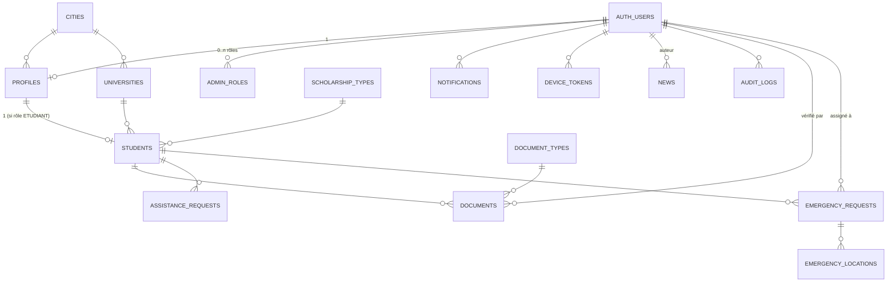

# ADM — Plan de projet technique (Mission 1)

**Association Djiboutienne au Maroc — Application mobile + Dashboard**
Document produit en réponse au cahier des charges v1.0, conformément à la mission décrite en §63 : analyse, arborescence, schéma SQL, RLS, rôles, variables d'environnement, dépendances Flutter et plan de développement — **avant toute implémentation**.

---

## 1. Résumé de l'analyse

Le projet comporte trois briques : une application **Flutter** (Android + iOS) pour les étudiants, un **dashboard web** pour le bureau ADM, et un backend **Supabase** (PostgreSQL + Auth + Storage + Edge Functions) partagé par les deux.

Principes structurants retenus du cahier des charges, appliqués strictement dans les livrables ci-joints :

- **RLS activé sur toutes les tables** contenant des données personnelles ; aucune table n'est laissée accessible publiquement.
- **Le rôle n'est jamais déduit d'une valeur envoyée par le client** — il est relu côté serveur depuis `admin_roles` à chaque requête (fonctions `SECURITY DEFINER`).
- **Aucun suivi de localisation permanent** — uniquement un partage ponctuel et volontaire, associé à une demande d'urgence, en lecture restreinte aux responsables autorisés.
- **Aucune suppression automatique** de document expiré — seul le statut évolue.
- **Documents en Storage privé**, jamais d'URL publique permanente.
- **Valeurs configurables sans reconstruire l'app** (types d'établissement, catégories d'urgence, seuils d'expiration) via une table `app_settings`.
- **Développement progressif par phases**, chaque étape validée avant la suivante (voir §8).

### Points identifiés nécessitant une clarification ou un complément

Le cahier des charges est très détaillé, mais quelques zones méritent d'être tranchées avant l'implémentation. Des choix par défaut raisonnables ont été faits pour chacune ; ils sont documentés ici et facilement réversibles :

| # | Point | Constat | Choix proposé |
|---|-------|---------|----------------|
| 1 | **Assistance vs Urgence** | §6, §42 (écran 17 "Centre d'assistance") distinguent une "demande d'assistance" d'une "demande d'urgence", mais §25 ne liste que `emergency_requests`. | Table dédiée `assistance_requests` (non géolocalisée, non critique, traitée comme un ticket de support) ajoutée au schéma. Fusionnable avec `emergency_requests` si l'ADM préfère un flux unique. |
| 2 | **Jetons push (FCM/APNs)** | §49 exige des notifications ciblées (ville, établissement, critères), mais aucune table ne stocke les jetons d'appareil. | Table `device_tokens` ajoutée (strictement privée à son propriétaire). |
| 3 | **Périmètre du rôle RESPONSABLE** | §7 dit "droits limités selon les responsabilités attribuées" sans préciser le mécanisme. | `admin_roles.scope_city_ids` / `scope_institution_ids` (tableaux d'UUID) : un RESPONSABLE sans périmètre défini n'a accès à aucun étudiant, par défaut restrictif. À valider avec l'ADM — un modèle par affectation nominative (table de liaison responsable↔étudiant) est une alternative si le filtrage par ville/établissement est trop grossier. |
| 4 | **Listes "configurables"** (type d'établissement, catégories d'urgence/actu, niveaux académiques) | Le cahier des charges demande que ces valeurs soient modifiables sans reconstruire l'app, sans toujours prévoir de table dédiée. | Stockées dans `app_settings` (clé/valeur JSONB), éditables par SUPER_ADMIN depuis le dashboard, lues par l'app au démarrage. `document_types` et `scholarship_types` restent des tables dédiées (elles ont des métadonnées propres : `is_required`, `requires_expiry_date`, etc.). |
| 5 | **Statut "EXPIRE" des documents** | §9 stocke `EXPIRE` comme statut, §10 décrit un niveau d'alerte calculé (VALIDE/À_SURVEILLER/.../EXPIRÉ). | Deux notions séparées : `documents.status` = workflow de vérification (géré par l'admin) ; `get_document_alert_level()` = niveau d'alerte calculé à la volée à partir de `expiry_date` (jamais stocké, toujours à jour). Une tâche planifiée (pg_cron ou Edge Function quotidienne) fait passer `status` à `EXPIRE` et déclenche les rappels. |
| 6 | **Framework du dashboard web** | Le cahier des charges impose Flutter pour le mobile mais ne précise pas la techno du dashboard ("Interface Web"). | Proposition : **Next.js (React) + TypeScript + Tailwind CSS + shadcn/ui**, avec `@supabase/supabase-js` et `@supabase/ssr`. Alternative possible : Flutter Web pour un seul langage sur tout le projet — moins riche en composants de type tableau/carte pour de l'admin, mais réutilise les modèles Dart. À trancher avec l'ADM avant la Phase 5. |

---

## 2. Arborescence du projet

### 2.1 Dépôt (monorepo proposé)

```
adm-app/
├── mobile/                    # Application Flutter (voir §2.2)
├── dashboard/                 # Dashboard web ADM (voir §2.3)
├── supabase/
│   ├── migrations/            # Migrations SQL versionnées (schema.sql découpé en migrations)
│   ├── functions/             # Edge Functions (Deno)
│   │   ├── send-push/
│   │   ├── expiration-reminders/      # tâche planifiée quotidienne
│   │   ├── notify-targeted/
│   │   └── admin-actions/             # opérations privilégiées (service_role)
│   ├── seed.sql
│   └── config.toml
├── docs/
│   ├── PROJECT_PLAN.md        # ce document
│   └── database/              # schema.sql, rls_policies.sql, seed_data.sql
├── .github/workflows/         # CI (lint, tests, build)
└── README.md
```

Un monorepo simplifie la synchronisation des types générés depuis Supabase (`supabase gen types`) entre le mobile et le dashboard. Deux dépôts séparés fonctionnent tout aussi bien si l'ADM préfère des cycles de release indépendants.

### 2.2 Application Flutter (`mobile/lib/`)

Reprend l'arborescence du cahier des charges (§5), détaillée par sous-couches à l'intérieur de chaque feature :

```
lib/
├── main.dart
├── app/
│   ├── app.dart                 # MaterialApp.router, providers globaux
│   ├── routes.dart              # go_router : routes + guards par rôle
│   └── theme.dart                # Material 3, couleurs/logo ADM, mode sombre (v2)
│
├── core/
│   ├── constants/                # clés app_settings, routes nommées, durées cache
│   ├── errors/                   # AppException, mapping erreurs Supabase → messages FR lisibles
│   ├── services/
│   │   ├── supabase_service.dart
│   │   ├── storage_service.dart      # upload documents, URLs signées
│   │   ├── notification_service.dart # FCM + flutter_local_notifications
│   │   ├── location_service.dart     # géoloc ponctuelle, jamais de tracking
│   │   └── connectivity_service.dart
│   ├── utils/                    # validators, formatters de date, extensions
│   └── widgets/                  # boutons, champs de formulaire, états de chargement/erreur communs
│
├── features/
│   ├── auth/
│   │   ├── data/                 # repository (appels Supabase Auth)
│   │   ├── domain/                # entités, cas d'usage
│   │   └── presentation/          # screens (login, signup, mot de passe oublié), providers, widgets
│   ├── home/
│   ├── profile/                   # profil, modification, situation académique
│   ├── students/                  # (réutilisé côté admin si Flutter partagé — sinon vide côté mobile étudiant)
│   ├── documents/                 # liste, ajout (camera/galerie), détail, statut/alerte
│   ├── news/                      # liste, détail
│   ├── notifications/             # centre de notifications
│   ├── assistance/                # centre d'assistance (ticket non urgent)
│   ├── emergency/                 # bouton urgence, formulaire, confirmation, partage position
│   └── settings/                  # paramètres, confidentialité, déconnexion
│
├── models/                        # DTOs générés/alignés sur le schéma Supabase (freezed + json_serializable)
│
test/
├── unit/
├── widget/
└── integration/
```

Chaque `feature/*` suit `data / domain / presentation` pour rester indépendante et testable, conformément à la demande du cahier des charges (§5).

### 2.3 Dashboard web (`dashboard/`, proposition Next.js)

```
dashboard/
├── app/
│   ├── (auth)/login/
│   ├── (dashboard)/
│   │   ├── page.tsx                  # vue d'ensemble (§22)
│   │   ├── etudiants/
│   │   ├── documents/
│   │   ├── actualites/
│   │   ├── notifications/
│   │   ├── urgences/
│   │   ├── administrateurs/
│   │   ├── statistiques/
│   │   └── parametres/
│   └── layout.tsx
├── components/                       # tables, cartes, formulaires réutilisables
├── lib/
│   ├── supabase/                     # clients browser + server (RSC), jamais de service_role côté navigateur
│   └── permissions.ts                # helpers de vérification de rôle côté UI (jamais la seule protection)
└── middleware.ts                     # protège les routes /(dashboard) par session
```

---

## 3. Schéma de base de données

Le schéma complet, prêt à l'exécution, est livré dans trois fichiers séparés (voir `database/`) :

1. **`schema.sql`** — extensions, types énumérés, 18 tables (15 imposées par le §25 + 3 ajouts documentés en §1), index, triggers `updated_at`, fonction de calcul d'alerte d'expiration, trigger de création automatique de profil à l'inscription, trigger d'audit automatique sur la vérification des documents.
2. **`rls_policies.sql`** — activation RLS sur toutes les tables sensibles, fonctions `SECURITY DEFINER` (`fn_has_role`, `fn_is_owner_student`, `fn_can_manage_student`), politiques par table et par opération.
3. **`seed_data.sql`** — données de départ (villes marocaines, types de documents, types de bourse, seuils et listes `app_settings`).

**Les trois fichiers ont été exécutés avec succès sur une instance PostgreSQL 16 locale** (aucune erreur de syntaxe ni de référence), puis validés fonctionnellement avec un jeu de données de test simulant les JWT Supabase (`auth.uid()`/`auth.role()`) : un étudiant ne voit que ses propres données, ne peut pas s'auto-valider un document, ne peut pas insérer une localisation sur la demande d'urgence d'un autre étudiant ; un ADMIN voit tout et peut vérifier un document ; un RESPONSABLE cantonné à une ville ne voit que les étudiants de cette ville ; `audit_logs` n'est lisible que par SUPER_ADMIN. Le détail des 11 scénarios testés est repris en §7.3 (Tests).

### 3.1 Relations entre les tables



Points de conception à noter :

- `profiles` est commune à **tous** les utilisateurs (étudiants et membres ADM) ; `students` l'étend uniquement pour le rôle ETUDIANT. Un membre du bureau a donc un `profiles` sans ligne `students`.
- Le rôle vit exclusivement dans `admin_roles` (table séparée), jamais comme colonne sur `profiles` — évite qu'un champ modifiable côté client ne devienne un vecteur d'élévation de privilège.
- `verified_by`, `assigned_to`, `author_id` référencent toujours `auth.users(id)` (qui a agi), tandis que `student_id` référence toujours `students(id)` (sur quoi porte l'action).

---

## 4. Rôles et permissions (RBAC)

Matrice des permissions telles qu'implémentées dans `rls_policies.sql`. "Périmètre" signifie limité aux villes/établissements attribués via `admin_roles.scope_*`.

| Action | SUPER_ADMIN | ADMIN | RESPONSABLE | ETUDIANT |
|---|---|---|---|---|
| Gérer les administrateurs et rôles | ✅ | ❌ | ❌ | ❌ |
| Gérer les paramètres généraux (`app_settings`, listes de référence) | ✅ | ❌ | ❌ | ❌ |
| Consulter tout étudiant | ✅ | ✅ | 🔶 périmètre | ❌ |
| Modifier un dossier étudiant | ✅ | ✅ | 🔶 périmètre | soi-même uniquement |
| Vérifier / refuser un document | ✅ | ✅ | 🔶 périmètre | ❌ |
| Ajouter ses propres documents | — | — | — | ✅ |
| Publier / modifier une actualité | ✅ | ✅ | ❌ | lecture des actualités publiées uniquement |
| Envoyer une notification ciblée | ✅ | ✅ | ❌ | reçoit uniquement |
| Traiter une demande d'assistance | ✅ | ✅ | 🔶 périmètre | créer + consulter la sienne |
| Traiter une demande d'urgence | ✅ | ✅ | 🔶 périmètre | créer + consulter la sienne |
| Voir la localisation d'une urgence | ✅ | ✅ | 🔶 périmètre / si assigné | consulter la sienne uniquement |
| Consulter les statistiques | ✅ | ✅ (portée à définir) | ❌ | ❌ |
| Consulter le journal d'audit | ✅ | ❌ (proposition, ajustable) | ❌ | ❌ |
| Désactiver un compte | ✅ | ✅ | ❌ | demander sa propre désactivation |

**Rappel de sécurité (cahier des charges §36) :** cette matrice est appliquée **côté serveur** via RLS et des fonctions `SECURITY DEFINER`. Le rôle affiché dans l'app Flutter ou le dashboard ne sert qu'à l'UX (masquer/afficher des boutons) — il n'est jamais la preuve d'autorisation.

---

## 5. Variables d'environnement

Aucun secret n'est jamais commité dans Git. Les fichiers `.env*` sont dans `.gitignore` ; seuls des `*.env.example` sont versionnés.

### 5.1 Application Flutter (`mobile/.env` — via `flutter_dotenv` ou `--dart-define-from-file`)

```
SUPABASE_URL=              # URL du projet Supabase (development / staging / production)
SUPABASE_ANON_KEY=         # clé publique anon — jamais la clé service_role
ENVIRONMENT=development    # development | staging | production
SENTRY_DSN=                # optionnel — suivi des crashs
```

⚠️ La clé `service_role` de Supabase **ne doit jamais** apparaître dans le code Flutter, ni committée, ni même en clair dans un fichier `.env` embarqué dans le binaire — elle donne un accès total qui contourne RLS.

### 5.2 Dashboard web (`dashboard/.env.local`)

```
NEXT_PUBLIC_SUPABASE_URL=
NEXT_PUBLIC_SUPABASE_ANON_KEY=
SUPABASE_SERVICE_ROLE_KEY=     # UNIQUEMENT côté serveur (route handlers / server actions), jamais exposée au navigateur
```

### 5.3 Supabase (secrets de projet, configurés dans le dashboard Supabase — pas dans le dépôt)

```
FCM_SERVICE_ACCOUNT_JSON=      # pour l'envoi de notifications push via Firebase Cloud Messaging
RESEND_API_KEY=                # si envoi d'emails transactionnels (vérification, etc.)
CRON_SECRET=                   # protège les Edge Functions déclenchées par pg_cron / Scheduled Triggers
```

---

## 6. Dépendances Flutter proposées (`pubspec.yaml`)

Versions volontairement non figées ici (à résoudre via `flutter pub add` pour obtenir les dernières versions stables compatibles au moment du démarrage effectif) :

**Cœur / architecture**
`supabase_flutter` · `flutter_riverpod` + `riverpod_annotation` · `go_router` · `freezed` + `freezed_annotation` · `json_annotation` + `json_serializable` · `build_runner`

**Formulaires & validation**
`reactive_forms` (ou validation manuelle légère selon préférence de l'équipe)

**Documents & médias**
`image_picker` · `file_picker` · `cached_network_image` · `flutter_image_compress`

**Notifications push**
`firebase_core` · `firebase_messaging` · `flutter_local_notifications`

**Localisation (partage volontaire uniquement)**
`geolocator` · `flutter_map` (ou `google_maps_flutter` si Google Maps est préféré pour l'aperçu carte)

**Stockage local & réseau**
`flutter_secure_storage` (tokens) · `hive` ou `shared_preferences` (cache non sensible uniquement) · `connectivity_plus`

**Permissions**
`permission_handler` — demandées au moment de l'usage (§40), jamais toutes au lancement

**UI / UX**
`flutter_svg` · `shimmer` (états de chargement) · `intl` (dates/formats FR)

**Dev / qualité**
`flutter_lints` · `mocktail` · `integration_test`

---

## 7. Plan de développement par phases

Conformément à la règle fondamentale du cahier des charges (§60) : chaque phase est développée, testée et validée avant de passer à la suivante — aucun développement massif d'un seul bloc.

### Phase 1 — Fondations
- Initialisation du projet Flutter + structure `lib/` définie en §2.2.
- Création du projet Supabase, application de `schema.sql` puis `rls_policies.sql` puis `seed_data.sql`.
- Authentification (email/mot de passe, session persistante).
- Vérification que le trigger `handle_new_user` crée bien un `profiles` à l'inscription.
- **Critère de validation** : un compte peut s'inscrire, se connecter, se déconnecter ; RLS empêche tout accès aux données d'un autre utilisateur (tests similaires à ceux du §3).

### Phase 2 — Étudiant
- Écrans profil / modification profil / situation académique.
- Module documents : ajout (caméra/galerie), liste avec niveau d'alerte (`get_document_alert_level`), détail.
- **Critère de validation** : un étudiant peut compléter son profil et téléverser un document ; le document n'est visible que par lui-même et les admins ; l'URL du fichier n'est jamais publique (Storage privé + URL signée à durée limitée).

### Phase 3 — Communication
- Actualités (liste, détail) côté étudiant ; création/publication côté dashboard.
- Centre de notifications + intégration FCM (jetons enregistrés dans `device_tokens`).
- Rappels d'expiration automatiques (Edge Function planifiée quotidienne s'appuyant sur `v_documents_with_alert`).
- **Critère de validation** : publier une actualité déclenche (optionnellement) une notification reçue par un compte de test ; les rappels J-90/30/7/expiré s'envoient correctement sur des documents de test à dates contrôlées.

### Phase 4 — Assistance & urgence
- Centre d'assistance (ticket simple).
- Bouton urgence (double confirmation, avertissement §21), catégories configurables, partage de position volontaire.
- **Critère de validation** : la localisation d'une urgence n'est lisible que par un responsable autorisé (test RLS dédié) ; aucune donnée de localisation n'est envoyée sans action explicite de l'étudiant.

### Phase 5 — Administration (dashboard)
- Décision du framework dashboard actée (voir §1, point 6).
- Gestion étudiants (recherche, filtres, fiche détail), vérification documents, gestion actualités/notifications ciblées, gestion urgences, gestion administrateurs/rôles, statistiques, journal d'audit.
- **Critère de validation** : toutes les actions administratives sensibles (vérification document, changement de rôle, consultation d'un dossier) apparaissent dans `audit_logs`.

### Phase 6 — Qualité
- Tests Flutter (auth, navigation, formulaires, documents, actualités, notifications, urgence) et tests backend (RLS, permissions, expiration) — étendre le jeu de tests RLS livré en §3.
- Tests sur appareils réels (Android récent/milieu de gamme, iPhone récent/ancien supporté).
- Revue de sécurité complète contre la liste du §61 du cahier des charges.

### Phase 7 — Publication
- Android : icône, nom, package name, signature, `.aab`, fiche Google Play, politique de confidentialité.
- iOS : Bundle ID, certificats, build, App Store Connect, fiche, informations de confidentialité.
- Nom final de l'application confirmé avec l'ADM avant soumission (§57).

---

## 8. Prochaines étapes

Conformément au point 63.10 du cahier des charges, **aucune implémentation ne démarre avant validation de ce document**. Merci de confirmer notamment :

1. Les 4 ajouts au schéma (`assistance_requests`, `device_tokens`, périmètre `RESPONSABLE`, `app_settings` pour les listes configurables) — §1.
2. Le choix du framework du dashboard (Next.js proposé, ou Flutter Web) — §1, point 6.
3. La matrice de permissions §4, en particulier l'accès ADMIN aux statistiques et au journal d'audit.
4. La structure monorepo proposée en §2.1 (ou dépôts séparés).

Une fois ces points validés, la Phase 1 peut démarrer.
